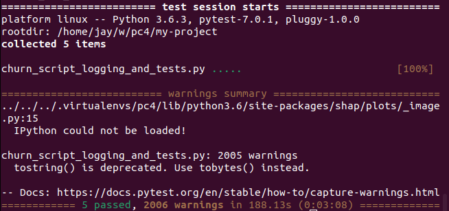

# Predict Customer Churn

Project **Predict Customer Churn** of ML DevOps Engineer Nanodegree Udacity

## Project Description

In this project, we identify credit card customers that are most likely to churn. The completed project includes a Python package for a machine learning project that follows coding (PEP8) and engineering best practices for implementing software (modular, documented, and tested). The package will also have the flexibility of being run interactively or from the command-line interface (CLI).

## Files and data description

- `data/`
  - `bank_data.csv`: The dataset for this project.
- `images/`
  - `eda/`
    - `age_hist.png`: Ages histogram
    - `churn_hist.png`: Churns histogram
    - `corrplot.png`: Correlation plot between all numerical variables
    - `marital_bar.png`: Marital status distribution bar plot
    - `ttc_dens.png`: Total transaction distribution plot
  - `results/`
    - `classification_results.png`: Results of the classification process
    - `feature_importances.png`: Feature importances report
    - `roc_curve.png`: ROC curve report
    - `summary.png`: Summary plot that shows feature impacts

- `models/`:
  - `logistic_model.pkl`: The file that contains the logistic model
  - `rfc_model.pkl`: The file that contains the random forest classifier model
- `test_images/**` and `test_models/*`: same as `images/**` and `models/*` but
  for the tests
- `churn_library.py`: The refactored script
- `churn_notebook-original.pynb`: The original notebook that contains
  unrefactored code.
- `churn_notebook.pynb`: The notebook that contains unrefactored code
- `churn_script_logging_and_testing.py`: Unit testing file. Uses `pytest`
- `Guide.ipynb`: The notebook that contains a guidance for this project.
- `README.md`: This documentation file.
- `requirements_py3.6.txt`: Python requirements file for Python 3.6.3.
- `requirements_py3.8.txt`: Python requirements file for Python 3.8.
- `successful_pytest_run.png`: A screenshot showing a successful pytest run.


## Running Files

The project was tested with Python 3.6.3. After setting up the environment to use
Python 3.6.3, run the following command to install all required modules:

```
pip install -r requirements_py3.6.txt
```

To test with `pytest`, run this command:

```
pytest churn_script_logging_and_testing.py
```

Logs of the pytest run are stored in the `./logs/` directory.

Note: If you want to display the print outputs, you may run it with a `-s` argument.

To do a test-run with all functions in the library, simply run it like so:

```
python churn_library.py
```

## Code Quality Metrics

### Follows PEP 8 Guidelines

- Running `pylint ./churn_library.py` gave me a score of 7.86.
- Running `pylint ./churn_script_logging_and_tests.py` gave me a score of 7.74.


### Runs Successfully

Running the pytest command above locally produced the following output:



Notice that all five tests ran successfully.
